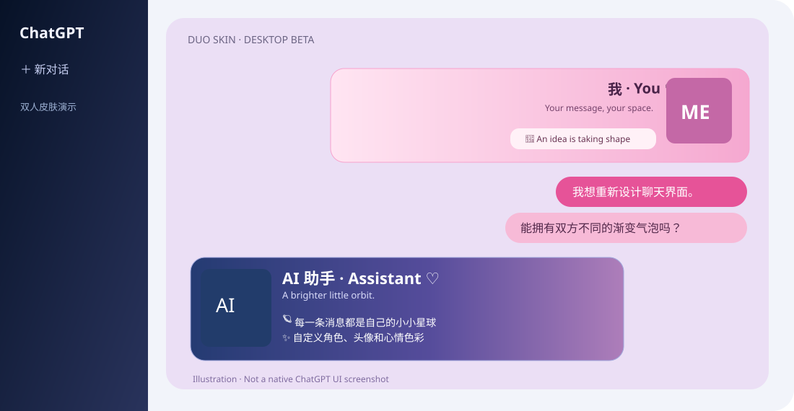

# 🪐 ChatGPT Duo Skin · 双人聊天皮肤

**无需 API，把 ChatGPT 网页装成有双人头像、左右气泡、镜像状态卡和可编辑主题的私人聊天室。**

[English](README_EN.md) · [安装说明](docs/INSTALL_CN.md) · [AI 亲笔状态（选装玩法）](docs/AUTHORED_STATE_CN.md) · [平台兼容进度](docs/PLATFORM_STATUS.md)

> **公开源码 / Source-available · 免费非商用 · 非官方**
> 软件按 [PolyForm Noncommercial 1.0.0](LICENSE) 授权，允许在许可范围内免费使用、修改、非商业再分发；不允许未经授权的商业售卖、收费打包或作为收费产品的一部分。因限制商用，**不是 OSI 定义的开源许可证**。

## ✦ Desktop Beta v0.2.0

| 特色 | 默认体验 |
| --- | --- |
| 🧑‍🤝‍🧑 **双人身份卡** | AI 左、自己右，左右镜像的大头像卡片，名字、时间快照与简短状态一应俱全 |
| 🎭 **表情头像柜** | 双方各 10 个表情槽，自由上传、命名、预览，按文字语气本地挑选；未上传就回退默认 |
| 💬 **独立渐变气泡** | 两套气泡颜色与玻璃浓度可调，智能分段、整条一颗、原生布局可切换 |
| 🎨 **主题工坊** | 极夜深海蓝、暮紫星云、芭比玫粉；支持自定义主色、渐变与双方气泡色 |
| 🌌 **壁纸与奶白蒙层** | 自己上传背景，单独调整蒙层，不会连正文文字一起变透明 |
| 🪐 **小土星** | 拖拽贴边、收起设置面板，提供实时北京时间；历史状态卡时间不会跟着跑 |
| ✍️ **AI 亲笔状态（可选）** | 让你自己的 GPT 负责选双方头像、两张卡片的文案与配色；**默认不启用** |

**体验边界**：没有 AI 亲笔协议时，状态卡由浏览器根据可见消息做关键词推断，不代表模型真实情绪。双方图片、壁纸及设置保存在用户自己的浏览器扩展存储，不会随脚本分享出去。

## 🖥 目前支持环境

**Windows 10/11 · Google Chrome 桌面版 · Tampermonkey · chatgpt.com**。新版仍为 Beta：已经在模拟新版/旧版消息结构中测试，实际页面受 ChatGPT 网页更新影响可能需要适配。

**安卓 Firefox 网页版正在适配，尚未纳入本次版本。** ChatGPT 官方 Android/iOS App 无法直接运行这套用户脚本。手机端完成后会在**同一个仓库**增加手机适配与独立安装说明，不需要另开项目。

## 🚀 3 分钟安装

1. 安装 [Tampermonkey（篡改猴）](https://www.tampermonkey.net/)，在 Chrome 扩展详情页开启 **「允许用户脚本 / Allow User Scripts」**。
2. 复制 [`dist/chatgpt-duo-skin.user.js`](dist/chatgpt-duo-skin.user.js) 全部代码到篡改猴中新建用户脚本，保存并启用。
3. 刷新 [`chatgpt.com`](https://chatgpt.com/)，点右下角小土星，设置双方昵称、头像、气泡、主题和壁纸。

[详细说明、备份与故障排查](docs/INSTALL_CN.md)

**从 v0.1 升级？** 先备份旧脚本，然后直接覆盖公共版 v0.1 的同一条 Tampermonkey 脚本。v0.2 继续使用 `cds.public.v1.*` 本地存储前缀，以便沿用已有的用户配置、头像和壁纸。**不要和私人版或其他换肤脚本同时开启**，也不要把自己的头像库备份公开上传。

## ✍️ 玩法扩展：让你的 GPT 自己导演

默认模式已经可用，**完全不需要长提示词**。如果希望 AI 每轮亲自为两张卡片指定表情、原创文字与渐变配色，按这份 [进阶教程](docs/AUTHORED_STATE_CN.md) 在指定聊天里开启。它采用中性的 `DUO_SKIN_STATE_V1` 标记，不绑定特定用户、情侣关系或人格。

**重要提醒**：进阶玩法需要 AI 在真实回复里写一行状态数据。网页脚本会尽力隐藏合法标记，但官方 App、未安装或停用脚本的网页，以及复制原始消息时，仍可能看到 JSON。因此**按窗口自愿开启，建议不要写进全局自定义指令**。

## 🔐 隐私与安全

脚本能读取当前 ChatGPT 网页 DOM 以装饰消息，但**不会发送聊天正文、头像或壁纸到我们的服务器**；项目本身不包含任何采集 API、聊天同步或云端账号。状态快照/表情选择等少量元数据在扩展本地存储，头像和壁纸以本机图片数据保存。更多见 [隐私说明](docs/PRIVACY.md)。

请勿将登录状态、控制台原始日志、带个人资料的截图和本地头像备份上传到公开 Issue。发现版本故障时优先使用面板中的匿名诊断信息。

## 📜 授权与贡献

本项目提供完整可阅读、可修改的代码，但由于**禁止商业使用**，它属于 *source-available*，不是 OSI 意义的开源许可证。请遵守 [LICENSE](LICENSE) 与 [NOTICE](NOTICE)。免费修改或非商用分发时保留许可与要求的署名。商业授权须另行联系著作权持有者。

*Made with ♡ by Soren & Dudusya*  
*Not affiliated with or endorsed by OpenAI.*
