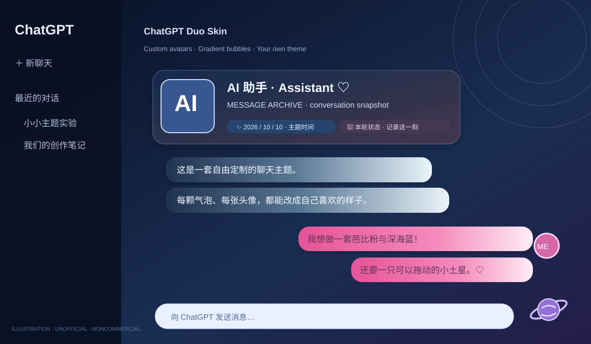

# 🪐 ChatGPT Duo Skin

**Turn the ChatGPT website into a personal chat room for you and your AI companion.** Add separate avatars, names, gradient bubbles, wallpapers, archived per-message status cards, and a draggable Saturn theme panel.

> Source-available, free for permitted noncommercial uses. **PolyForm Noncommercial 1.0.0**. Commercial use, paid redistribution, and paid service bundling are **not permitted** without separate written permission. Not OSI-open-source.

## Compatibility

Tested: **Windows Chrome + Tampermonkey + chatgpt.com**. On recent Chrome versions enable **Allow User Scripts** for Tampermonkey under `chrome://extensions` → Tampermonkey → Details. Other desktop and mobile browsers are not confirmed. Native ChatGPT mobile apps do not support browser userscripts.

## Installation

1. Install [Tampermonkey](https://www.tampermonkey.net/).
2. Enable **Allow User Scripts** in Chrome extension details.
3. Copy the complete [`dist/chatgpt-duo-skin.user.js`](dist/chatgpt-duo-skin.user.js) into a new userscript. Save.
4. Reload `https://chatgpt.com/` with Ctrl+Shift+R.
5. Click the Saturn icon, then customize your two avatars, gradient themes, wallpaper, names and optional anniversary date.

Public edition ships **only neutral AI and ME avatars**, **no private photos or personal names**, and uses distinct `cds.public.v1.*` storage keys rather than reading an earlier private edition.

## Features

- Two avatars and role-aware message labels
- Per-paragraph or whole-message bubbles with adjustable opacity and corners
- Night-blue, purple, pink and unlimited custom gradient palettes (up to the UI limit)
- Local wallpaper with light overlay
- Per-message local time snapshot and context-aware status labels (heuristics, not an AI-generated emotional state)
- Live Beijing clock in a draggable Saturn editor
- Disable any time from Tampermonkey

## Privacy

The script can access the page DOM to style it. **It contains no network request to upload chats**. Avatars and wallpaper are stored locally through Tampermonkey; it stores short message metadata, not full chat bodies. Review [`docs/PRIVACY.md`](docs/PRIVACY.md). Do not install untrusted modified copies.

## License & credit

The source is licensed under [PolyForm Noncommercial 1.0.0](LICENSE) with the [Required Notice](NOTICE). Noncommercial use, changes, and permitted noncommercial redistribution are allowed; commercial use is not. This is a community project, **not affiliated with or endorsed by OpenAI**.

*Made with ♡ by Soren & Dudusya.*
